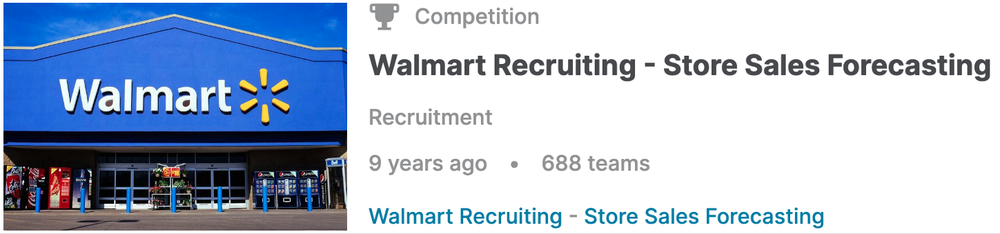
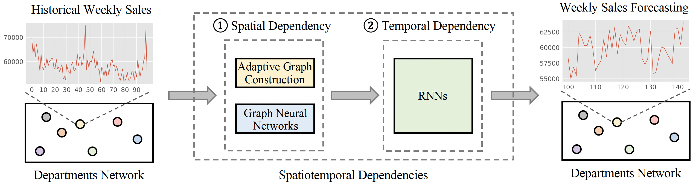

# [Kaggle] Adaptive Graph Convolutional Network for Walmart Recruiting Store Sales Forecasting

This is my Pytorch implementation for the kaggle competition solution: "Adaptive Graph Convolutional Network for Walmart Recruiting Store Sales Forecasting".
My framework is built based on framework of [AGCRN](https://github.com/LeiBAI/AGCRN).

<p align="center">
  
  <br>
  <b>Figure 1.</b> Walmart Recruiting - Store Sales Forecasting.
</p>
<p align="center">
  
  <br>
  <b>Figure 2.</b> The model architecture of the proposed competition solution.
</p>

## Installation
Clone this project:

```bash
git clone git@github.com:juyongjiang/AGCRN-Kaggle.git
```

Make sure you have `Python>=3.8` and `Pytorch>=1.8` installed on your machine. 

* Pytorch 1.8.1
* Python 3.8.*

Install python dependencies by running:

```bash
conda env create -f requirements.yml
# After creating environment, activate it
conda activate agcrn-kaggle
```

## Datasets Preparation
### Download
Download data from Kaggle Platform [https://www.kaggle.com/competitions/walmart-recruiting-store-sales-forecasting/data](https://www.kaggle.com/competitions/walmart-recruiting-store-sales-forecasting/data). Then, place them into `dataset` folder as follows.

```bash
$ tree
.
├── dataset
    ├── processed
    ├── features.csv
    ├── stores.csv
    ├── test.csv
    ├── train.csv
    └── preprocess.csv
...

### Preprocess
```bash
cd dataset
python preprocess.py
```

## Model Training and Forecasting
```bash
python -u main.py --gpu_id=3 2>&1 | tee agcrn_kaggle.log
```
Wait for a while ...

The submission file will be automatically generated and saved in `submission_agcrn_kaggle.csv`. 
Then, please submit it to Kaggle Platform [https://www.kaggle.com/competitions/walmart-recruiting-store-sales-forecasting/leaderboard](https://www.kaggle.com/competitions/walmart-recruiting-store-sales-forecasting/leaderboard) 


## Useful Link
- DAAGCN [arXiv-22]: [Paper](https://arxiv.org/abs/2208.03063) [Code](https://github.com/juyongjiang/DAAGCN)

- STFGNN [AAAI-21]: [Paper](https://arxiv.org/abs/2012.09641) [Code](https://github.com/MengzhangLI/STFGNN)

- STSGCN [AAAI-20]: [Paper](https://ojs.aaai.org/index.php/AAAI/article/view/5438) [Code_1](https://github.com/Davidham3/STSGCN) [Code_2](https://github.com/SmallNana/STSGCN_Pytorch)

- ASTGNN [TKDE-21]: [Paper](https://ieeexplore.ieee.org/document/9346058) [Code](https://github.com/guoshnBJTU/ASTGNN)

- ASTGCN [AAAI-19]: [Paper](https://ojs.aaai.org/index.php/AAAI/article/view/3881) [Code](https://github.com/guoshnBJTU/ASTGCN-r-pytorch)

- AGCRN [NIPS-20]: [Paper](https://arxiv.org/pdf/2007.02842.pdf) [Code](https://github.com/LeiBAI/AGCRN)

## Contact
Feel free to contact us if there is any question. (Juyong Jiang, jjiang472@connect.hkust-gz.edu.cn)

